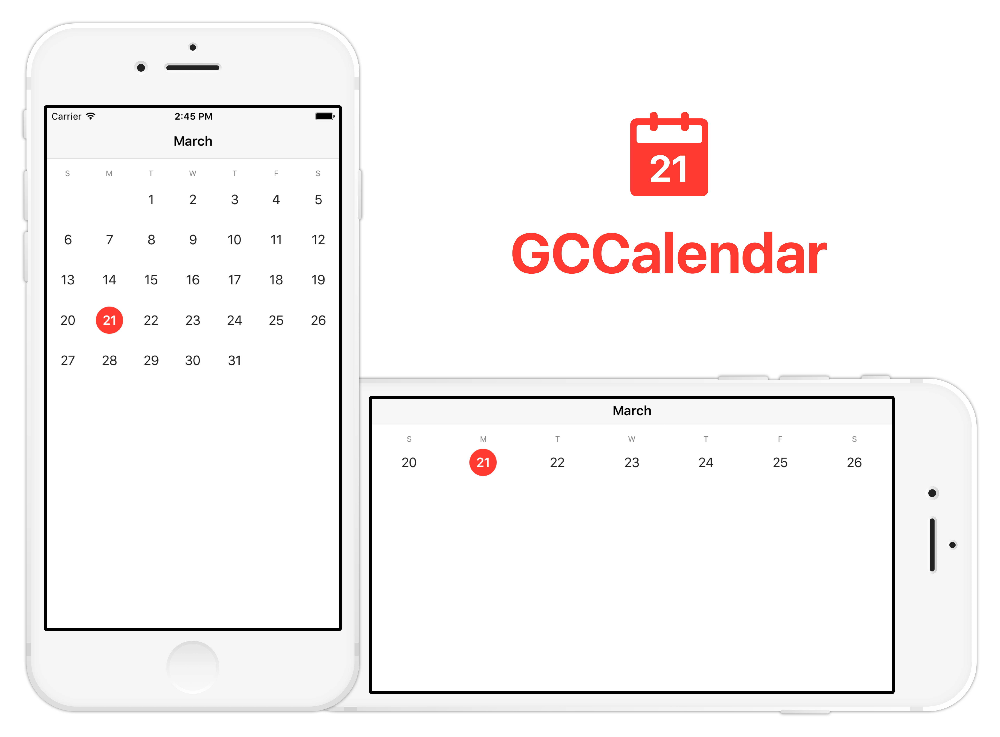

[](https://img.shields.io/cocoapods/v/GCCalendar.svg)
[](http://cocoadocs.org/docsets/GCCalendar)

### Overview

1. [CocoaPods](https://github.com/graycampbell/GCCalendar#cocoapods)
2. [Implementation](https://github.com/graycampbell/GCCalendar#implementation)
3. [GCCalendarView](https://github.com/graycampbell/GCCalendar#gccalendarview)
4. [GCCalendarViewDelegate](https://github.com/graycampbell/GCCalendar#gccalendarviewdelegate)

### CocoaPods

```
pod 'GCCalendar'
```

### Implementation

1. Add `GCCalendar` to your file's import statements.

2. Create an instance of GCCalendarView.

3. Set the delegate and the display mode. If you don't set the delegate and the display mode, the calendar will not appear.

4. Implement GCCalendarViewDelegate.

### GCCalendarView

```
init()
init(frame: CGRect)

var delegate: GCCalendarViewDelegate!
var displayMode: GCCalendarDisplayMode!

func today()
```

## GCCalendarViewDelegate

```
func calendarView(_ calendarView: GCCalendarView, didSelectDate date: Date)

func calendar(calendarView: GCCalendarView) -> Calendar

func weekdayLabelFont(calendarView: GCCalendarView) -> UIFont
func weekdayLabelTextColor(calendarView: GCCalendarView) -> UIColor

func pastDatesEnabled(calendarView: GCCalendarView) -> Bool
func pastDateFont(calendarView: GCCalendarView) -> UIFont
func pastDateEnabledTextColor(calendarView: GCCalendarView) -> UIColor
func pastDateDisabledTextColor(calendarView: GCCalendarView) -> UIColor
func pastDateSelectedFont(calendarView: GCCalendarView) -> UIFont
func pastDateSelectedTextColor(calendarView: GCCalendarView) -> UIColor
func pastDateSelectedBackgroundColor(calendarView: GCCalendarView) -> UIColor

func currentDateFont(calendarView: GCCalendarView) -> UIFont
func currentDateTextColor(calendarView: GCCalendarView) -> UIColor
func currentDateSelectedFont(calendarView: GCCalendarView) -> UIFont
func currentDateSelectedTextColor(calendarView: GCCalendarView) -> UIColor
func currentDateSelectedBackgroundColor(calendarView: GCCalendarView) -> UIColor

func futureDateFont(calendarView: GCCalendarView) -> UIFont
func futureDateTextColor(calendarView: GCCalendarView) -> UIColor
func futureDateSelectedFont(calendarView: GCCalendarView) -> UIFont
func futureDateSelectedTextColor(calendarView: GCCalendarView) -> UIColor
func futureDateSelectedBackgroundColor(calendarView: GCCalendarView) -> UIColor
```
